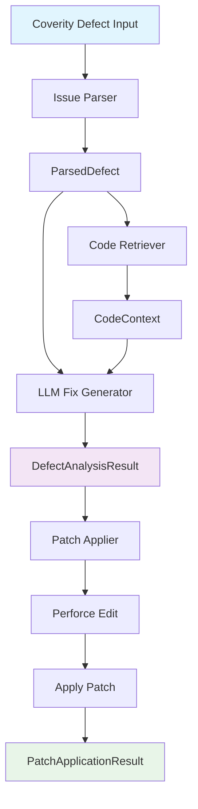

## ⚠️ TASK RESTRUCTURED

This task has been split into two subtasks for better manageability:

- **Task 8a**: Core Patch Application Components (foundational implementation)
- **Task 8b**: Pipeline Integration and End-to-End Verification (orchestration and testing)

Please work on tasks 8a and 8b instead of this original task.

---

## Description

Implement the foundational patch application system with safe validation, file backup mechanisms, and basic Perforce integration for applying generated patches to target codebases. **EXPANDED TO INCLUDE**: Complete end-to-end pipeline verification demonstrating the full workflow from file reading → LLM analysis → P4 edit → patch application.

## Enhanced Scope: Complete Pipeline Verification

This task now includes comprehensive verification of the complete Coverity Agent pipeline:

### 🔄 **Complete Pipeline Flow Verification**



### 📋 **Pipeline Integration Requirements**

1. **Input Processing Pipeline**:
   - Parse sample Coverity defects → `ParsedDefect` objects
   - Extract code context → `CodeContext` with function boundaries  
   - Generate fixes → `DefectAnalysisResult` with multiple candidates

2. **LLM Integration Pipeline**:
   - Process `ParsedDefect` + `CodeContext` through NVIDIA NIM
   - Generate multiple fix candidates with confidence scores
   - Validate generated fixes for syntax and style consistency

3. **Patch Application Pipeline**:
   - Validate `DefectAnalysisResult` patches before application
   - Execute `p4 edit` on target files for Perforce integration
   - Apply patches safely with backup and rollback capabilities
   - Generate comprehensive `PatchApplicationResult`

## Original Implementation Details

- **Patch Validator Component**: Create comprehensive validation system for patches before application
  - Validate file existence and permissions
  - Check patch format and structure
  - Detect conflicts with working directory
  - Return detailed validation results with errors and warnings

- **Basic Patch Application**: Implement core patch application functionality
  - Apply patches safely to target files
  - Handle text-based patches with proper line-by-line application
  - Support multiple file modifications in single patch

- **Backup Manager**: Create comprehensive backup system for safety
  - Create backups of all files before modification
  - Generate backup manifests with timestamps and file mappings
  - Implement backup restoration capabilities
  - Organize backups by patch ID for easy identification

- **Perforce Manager Foundation**: Build basic Perforce integration
  - Validate Perforce workspace state before operations
  - Use `p4 edit` to prepare files for modification
  - Basic Perforce status and workspace checking
  - Foundation for advanced Perforce features in later phases

- **Safety Framework**: Implement comprehensive safety mechanisms
  - Rollback capabilities for failed applications (p4 revert)
  - Validation of target workspace state
  - Error handling and recovery procedures
  - Logging of all operations for audit trail

- **Configuration System**: Basic configuration management
  - YAML-based configuration for patch applier settings
  - Safety and backup configuration options
  - Perforce workspace and client configuration settings

## 🧪 **Enhanced Test Strategy: End-to-End Pipeline Verification**

### **Integration Test Suite**: Complete Pipeline Validation

#### **Test 1: Complete Pipeline Flow Test**
```python
def test_complete_pipeline_integration():
    """Test complete pipeline from Coverity defect to applied patch."""
    
    # Step 1: Parse sample Coverity defect
    coverity_output = load_sample_coverity_defect()
    parsed_defect = issue_parser.parse_defect(coverity_output)
    
    # Step 2: Retrieve code context
    code_context = code_retriever.get_context(parsed_defect)
    assert code_context.function_context is not None
    assert len(code_context.surrounding_lines) > 0
    
    # Step 3: Generate fix using LLM
    fix_result = llm_fix_generator.analyze_and_fix(parsed_defect, code_context)
    assert fix_result.is_ready_for_application
    assert len(fix_result.fix_candidates) >= 1
    
    # Step 4: Apply patch with P4 integration
    patch_result = patch_applier.apply_patch(fix_result, working_directory)
    assert patch_result.overall_status == ApplicationStatus.SUCCESS
    assert len(patch_result.applied_changes) > 0
    
    # Step 5: Verify P4 operations
    assert any("p4 edit" in str(change.perforce_operations) 
               for change in patch_result.applied_changes)
```

#### **Test 2: P4 Edit and Patch Application Verification**
```python
def test_perforce_edit_and_patch_application():
    """Verify P4 edit operations and actual file modifications."""
    
    # Create test defect with known fix
    test_defect = create_test_null_pointer_defect()
    
    # Generate fix
    fix_result = llm_fix_generator.analyze_and_fix(test_defect, test_context)
    
    # Apply with P4 integration enabled
    config = PatchApplierConfig.create_default()
    config.perforce.enabled = True
    config.perforce.auto_checkout = True
    
    applier = PatchApplier(config)
    result = applier.apply_patch(fix_result)
    
    # Verify P4 operations were executed
    assert any(op["action"] == "edit" for change in result.applied_changes 
               for op in change.perforce_operations)
    
    # Verify file was actually modified
    modified_file = Path(config.working_directory) / fix_result.file_path
    assert modified_file.exists()
    
    # Verify patch content was applied
    with open(modified_file) as f:
        content = f.read()
        assert fix_result.recommended_fix.fix_code in content
```

#### **Test 3: Multi-Component Integration Test**
```python
def test_multi_component_integration():
    """Test integration between all pipeline components."""
    
    # Test data: Multiple defect types
    test_cases = [
        ("null_pointer_defect.json", "buffer_overflow_fix.c"),
        ("memory_leak_defect.json", "memory_leak_fix.c"),
        ("uninitialized_var_defect.json", "init_variable_fix.c")
    ]
    
    for defect_file, expected_fix_pattern in test_cases:
        # Complete pipeline execution
        defect = load_test_defect(defect_file)
        parsed = issue_parser.parse_defect(defect)
        context = code_retriever.get_context(parsed)
        fix_result = llm_fix_generator.analyze_and_fix(parsed, context)
        patch_result = patch_applier.apply_patch(fix_result)
        
        # Verify each stage
        assert parsed.defect_id is not None
        assert context.function_context is not None
        assert fix_result.confidence_score >= 0.5
        assert patch_result.overall_status in [ApplicationStatus.SUCCESS, ApplicationStatus.DRY_RUN_SUCCESS]
```

### **Pipeline Performance Tests**

#### **Test 4: End-to-End Performance Benchmark**
```python
def test_pipeline_performance():
    """Measure complete pipeline performance."""
    
    start_time = datetime.utcnow()
    
    # Process batch of 10 defects
    defects = load_sample_defects(count=10)
    results = []
    
    for defect_data in defects:
        parsed = issue_parser.parse_defect(defect_data)
        context = code_retriever.get_context(parsed)
        fix_result = llm_fix_generator.analyze_and_fix(parsed, context)
        patch_result = patch_applier.apply_patch(fix_result)
        results.append(patch_result)
    
    total_time = (datetime.utcnow() - start_time).total_seconds()
    
    # Performance assertions
    assert total_time < 300  # 5 minutes for 10 defects
    assert all(r.processing_time_seconds < 30 for r in results)  # <30s per defect
    assert sum(1 for r in results if r.overall_status == ApplicationStatus.SUCCESS) >= 8  # 80% success rate
```

### **Safety and Rollback Tests**

#### **Test 5: Rollback and Recovery Verification**
```python
def test_rollback_and_recovery():
    """Test rollback capabilities after failed operations."""
    
    # Create scenario that will fail after P4 edit
    defect = create_failing_defect_scenario()
    fix_result = llm_fix_generator.analyze_and_fix(defect, test_context)
    
    # Force failure during patch application
    config = PatchApplierConfig.create_default()
    config.safety.automatic_rollback_on_failure = True
    
    applier = PatchApplier(config)
    result = applier.apply_patch(fix_result)
    
    # Verify rollback was executed
    assert result.overall_status == ApplicationStatus.ROLLED_BACK
    
    # Verify P4 files were reverted
    assert any("p4 revert" in str(op) for change in result.applied_changes 
               for op in change.perforce_operations)
```

## 📊 **Pipeline Verification Dashboard**

### **Verification Metrics to Track**:

1. **Pipeline Completeness**:
   - ✅ Issue Parser → ParsedDefect conversion rate
   - ✅ Code Retriever → Context extraction success rate  
   - ✅ LLM Fix Generator → Fix generation success rate
   - ✅ Patch Applier → Application success rate

2. **Integration Points**:
   - ✅ ParsedDefect → CodeContext compatibility
   - ✅ CodeContext → DefectAnalysisResult integration
   - ✅ DefectAnalysisResult → PatchApplicationResult processing

3. **Perforce Integration**:
   - ✅ P4 workspace validation success rate
   - ✅ P4 edit operation success rate
   - ✅ Changelist creation success rate
   - ✅ Rollback/revert operation success rate

### **Success Criteria**:

- **Pipeline Completion**: >90% of defects successfully processed end-to-end
- **P4 Integration**: >95% successful P4 edit operations
- **Fix Quality**: >80% of generated fixes pass validation
- **Performance**: <30 seconds average processing time per defect
- **Safety**: 100% successful rollback when failures occur
- **Data Integrity**: Perfect data flow between all components

### **Original Test Strategy (Enhanced)**

- **Unit Tests**:
  - Test patch validation with various invalid patch formats
  - Test backup creation and restoration processes
  - Test patch application on sample files with known expected results
  - Test Perforce workspace state validation and error conditions
  - **NEW**: Test pipeline component integration points
  - **NEW**: Test data structure compatibility between components

- **Integration Tests**:
  - Test complete patch application workflow from validation to completion
  - Test rollback scenarios with intentional failures (p4 revert)
  - Test with actual generated patches from Fix Generator component
  - Test with various Perforce workspace states and configurations
  - **NEW**: Complete end-to-end pipeline tests with real Coverity data
  - **NEW**: Multi-defect batch processing tests

- **Safety Tests**:
  - Test backup system integrity and restoration accuracy
  - Test rollback capabilities after failed patch applications
  - Test error handling with corrupted or invalid patches
  - Test with large files and complex patches
  - **NEW**: Test P4 workspace recovery after failures
  - **NEW**: Test data consistency across pipeline failures

## 🎯 **Expected Pipeline Demonstration**

After completing this expanded task 8, you should be able to demonstrate:

1. **Input a Coverity defect report** → Parse to `ParsedDefect`
2. **Extract code context** → Generate `CodeContext` with function boundaries
3. **Generate fix via NVIDIA NIM** → Produce `DefectAnalysisResult` with multiple candidates  
4. **Execute P4 edit** → Prepare files for modification in Perforce
5. **Apply patch safely** → Modify files with backup and validation
6. **Generate comprehensive result** → `PatchApplicationResult` with all operations logged

This complete pipeline verification ensures the Coverity Agent works as an integrated system, not just individual components.

## Agent Notes

This task establishes the critical foundation for safe patch application **AND** provides comprehensive verification of the complete Coverity Agent pipeline. The expanded scope ensures that all components work together seamlessly from initial defect reading through final P4 patch application.

**Key Integration Focus**:
- Seamless data flow between Issue Parser → Code Retriever → LLM Fix Generator → Patch Applier
- Comprehensive P4 integration with proper edit, apply, and rollback operations
- End-to-end performance and safety validation
- Complete pipeline demonstration capabilities

Focus on safety mechanisms and comprehensive validation while ensuring the expanded pipeline verification demonstrates the complete workflow the user requested. 