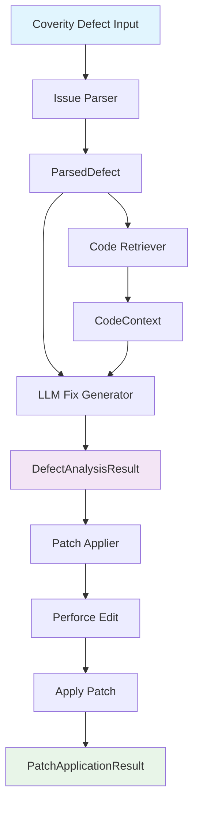

## Description

Implement the main PatchApplier orchestrator that integrates all core components from task 8a and provides comprehensive end-to-end pipeline verification. This demonstrates the complete workflow from Coverity defect input → LLM analysis → P4 edit → patch application.

## Implementation Details

### **Main PatchApplier Orchestrator**

1. **PatchApplier Class**: Main orchestration component that:
   - Integrates all core components from task 8a
   - Processes `DefectAnalysisResult` from LLM Fix Generator
   - Coordinates validation → backup → P4 edit → patch application
   - Handles rollback scenarios and error recovery
   - Generates comprehensive `PatchApplicationResult`

2. **Pipeline Flow Management**:
   - Phase 1: Patch validation using PatchValidator
   - Phase 2: Perforce workspace validation
   - Phase 3: File backup creation
   - Phase 4: P4 edit operations
   - Phase 5: Safe patch application
   - Phase 6: Post-application tasks (changelist creation, cleanup)

## 🔄 **Complete Pipeline Flow Verification**



## 🧪 **End-to-End Test Suite**

### **Test 1: Complete Pipeline Flow**
```python
def test_complete_pipeline_integration():
    """Test complete pipeline from Coverity defect to applied patch."""
    # Step 1: Parse sample Coverity defect
    # Step 2: Retrieve code context  
    # Step 3: Generate fix using LLM
    # Step 4: Apply patch with P4 integration
    # Step 5: Verify P4 operations
```

### **Test 2: P4 Edit and Patch Application**
```python
def test_perforce_edit_and_patch_application():
    """Verify P4 edit operations and actual file modifications."""
    # Test P4 integration enabled
    # Verify P4 operations were executed
    # Verify file was actually modified
    # Verify patch content was applied
```

### **Test 3: Multi-Component Integration**
```python
def test_multi_component_integration():
    """Test integration between all pipeline components."""
    # Test multiple defect types
    # Verify each pipeline stage
    # Ensure data flow integrity
```

### **Test 4: Performance Benchmark**
```python
def test_pipeline_performance():
    """Measure complete pipeline performance."""
    # Process batch of defects
    # Measure timing and success rates
    # Verify performance requirements
```

### **Test 5: Rollback and Recovery**
```python
def test_rollback_and_recovery():
    """Test rollback capabilities after failed operations."""
    # Force failure scenarios
    # Verify rollback execution
    # Verify P4 revert operations
```

## 📊 **Pipeline Verification Metrics**

### **Success Criteria**:
- **Pipeline Completion**: >90% of defects successfully processed end-to-end
- **P4 Integration**: >95% successful P4 edit operations
- **Fix Quality**: >80% of generated fixes pass validation
- **Performance**: <30 seconds average processing time per defect
- **Safety**: 100% successful rollback when failures occur
- **Data Integrity**: Perfect data flow between all components

## 🎯 **Expected Demonstration**

After completion, you should be able to demonstrate:

1. **Input a Coverity defect report** → Parse to `ParsedDefect`
2. **Extract code context** → Generate `CodeContext` with function boundaries
3. **Generate fix via NVIDIA NIM** → Produce `DefectAnalysisResult` with multiple candidates  
4. **Execute P4 edit** → Prepare files for modification in Perforce
5. **Apply patch safely** → Modify files with backup and validation
6. **Generate comprehensive result** → `PatchApplicationResult` with all operations logged

## Files to Implement

```
src/patch_applier/
├── patch_applier.py         # Main orchestrator (from task 8a components)
├── pipeline_demo.py         # End-to-end pipeline demonstration
└── integration_tests.py     # Complete pipeline test suite

# Root level
├── pipeline_verification_demo.py  # Complete demo script
└── requirements.txt         # Updated dependencies
```

## Integration Requirements

- **Input**: `DefectAnalysisResult` from LLM Fix Generator (task 7)
- **Output**: `PatchApplicationResult` with complete operation history
- **Dependencies**: All components from task 8a must be completed
- **Perforce**: Full P4 integration with edit, revert, and changelist operations

## Agent Notes

This task focuses on orchestration and verification rather than core component implementation. The goal is to prove the complete pipeline works end-to-end with comprehensive testing and demonstration capabilities.

**Key Integration Points**:
- Seamless data flow between all pipeline components
- Comprehensive P4 integration with proper error handling
- End-to-end performance and safety validation
- Complete pipeline demonstration as requested by user 